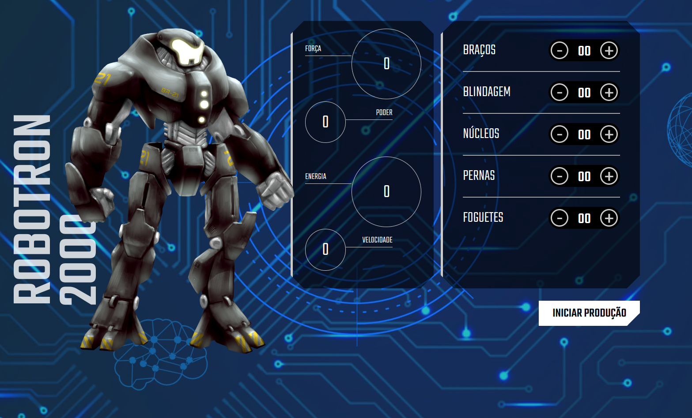

# Robotron 2000

Terra está sofrendo uma invasão alienígena e você precisa montar o seu robô para juntar as forças de defesa do planeta. Para montar o seu Robotron você precisa adicionar peças na engrenagem que compõe um robô e ver as estatísticas atualizadas dinamicamente.

| :placard: Vitrine.Dev |     |
| -------------  | --- |
| :sparkles: Nome        | **Robotron 2000**
| :label: Tecnologias | HTML, CSS e JavaScript
| :rocket: URL         | https://robotron-2000-bay-nu.vercel.app/
| :fire: Desafio     | -

## Detalhes do projeto

Projeto usando HTML, CSS e JavaScript com foco na manipulação do DOM. Nesse projeto aprendi: 
 • Manipular Elementos;  
• Interagir com o HTML;  
• Criar funções;  
• Criar operações lógicas;  

## Screenshots

## Desktop
</img>
